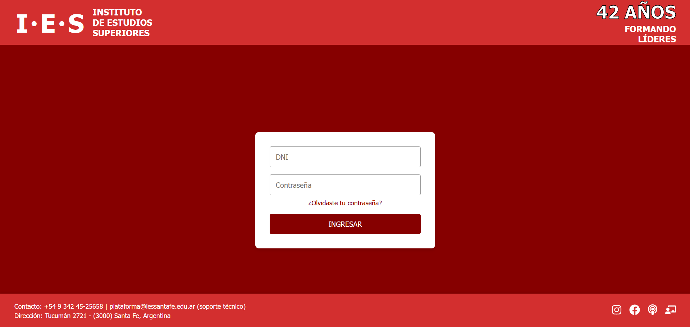
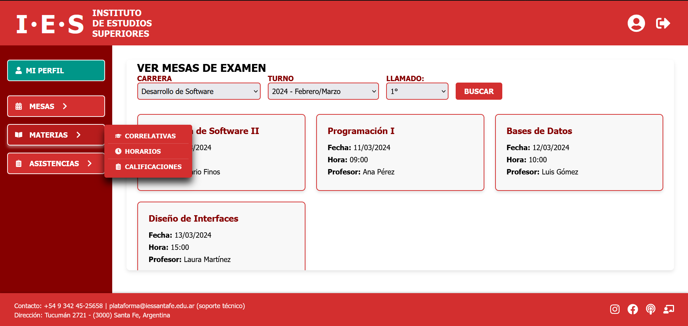
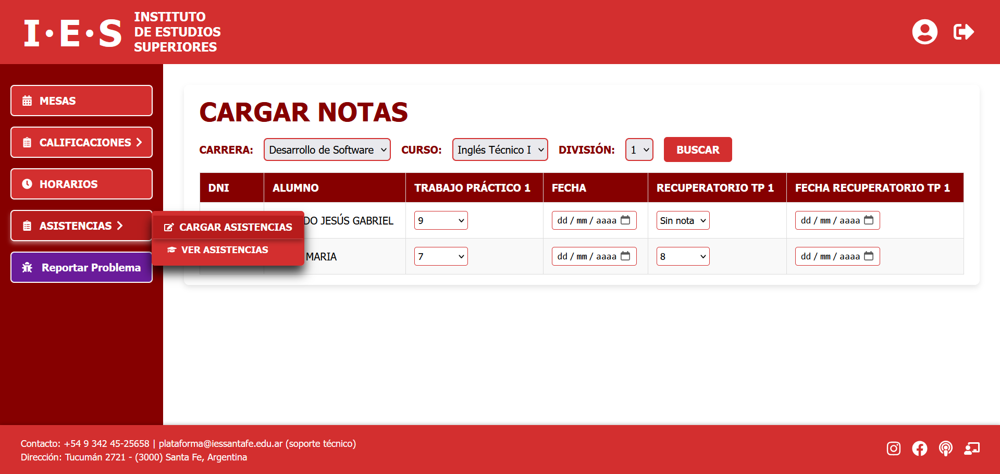
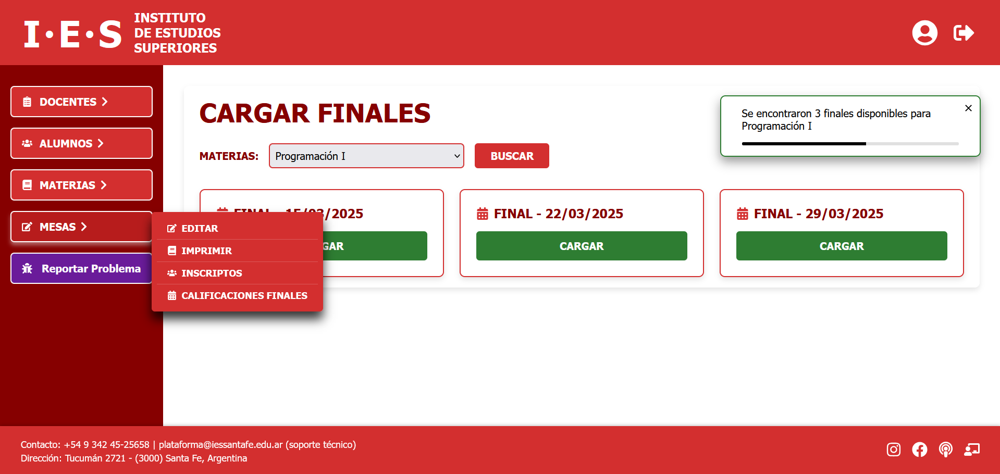

# 🎓 IES Management System

A comprehensive management system for higher education institutions built with Next.js and TypeScript. Features role-based dashboards for students, teachers, and coordinators with modern UI components and PDF generation capabilities.

## ✨ Key Features

- **Role-based Authentication** - Separate dashboards for Students, Teachers, and Coordinators
- **Academic Management** - Grade tracking, attendance, schedules, and exam registration
- **PDF Generation** - Automated reports and academic documents
- **Responsive Design** - Optimized for desktop and mobile devices
- **Real-time Notifications** - Toast notifications for user interactions
- **Modern UI** - Styled with Tailwind CSS and Styled Components

## 🛠️ Tech Stack

- **Framework**: Next.js 15.3.3 with App Router
- **Language**: TypeScript
- **Styling**: Tailwind CSS + Styled Components
- **UI/UX**: Framer Motion animations, React Icons
- **Forms**: React Hook Form with Zod validation
- **PDF Generation**: React PDF Renderer
- **Date Handling**: date-fns, React Datepicker

## 📸 Screenshots

### Login


### Student Dashboard


### Teacher Dashboard  


### Coordinator Dashboard


## 📁 Project Structure

```
src/
├── app/                    
│   ├── dashboard/         # Role-based dashboard routes
│   │   ├── alumno/       
│   │   ├── coordinador/  
│   │   └── docente/      
│   └── login/            # Authentication
├── components/           # Reusable React components
│   ├── Dashboard/        
│   ├── DashboardViews/   
│   └── Layout/           
├── contexts/             
├── hooks/               
├── interfaces/          
├── styles/              
├── types/               
└── utils/               
```


## 🚀 Getting Started

### Prerequisites

- Node.js (v18 or higher)
- pnpm (recommended)

### Installation

1. Clone the repository:
```bash
git clone https://github.com/your-username/ies-gestion-next.git
cd ies-gestion-next
```

2. Install dependencies:
```bash
pnpm install
```

3. Run the development server:
```bash
pnpm dev
```

Open [http://localhost:3000](http://localhost:3000) to view the application.

## 🎯 User Roles & Features

### 👨‍🎓 Students (Alumno)
- View grades and attendance
- Check class schedules
- Register for exams
- View subject correlatives

### 👩‍🏫 Teachers (Docente)
- Manage attendance
- Grade assignments and exams
- View teaching schedules
- Access student lists

### 👨‍💼 Coordinators (Coordinador)
- Search students, teachers, and subjects
- Manage schedules and exam sessions
- Generate academic reports
- Send notifications

## 📦 Available Scripts

```bash
pnpm dev          # Start development server with Turbopack
pnpm build        # Build for production
pnpm start        # Start production server
pnpm lint         # Run ESLint
```

## 🏗️ Architecture

- **Frontend-only**: Currently no backend integration
- **Component-based**: Modular React components with TypeScript
- **Styled Components**: CSS-in-JS with Tailwind utility classes
- **Form Handling**: React Hook Form with Zod validation
- **State Management**: React Context for notifications

## 🔧 Development Notes

- Built with Next.js 15 App Router
- Uses Turbopack for faster development builds
- Styled Components with SSR support via babel plugin
- PDF generation for academic documents and reports
- Responsive design with mobile-first approach

## 📄 License

This project is licensed under the MIT License.

## 👨‍💻 Author

**[Your Name]**
- GitHub: [@your-username](https://github.com/your-username)
- LinkedIn: [Your Profile](https://linkedin.com/in/your-profile)

---

⭐ If you found this project helpful, please give it a star!